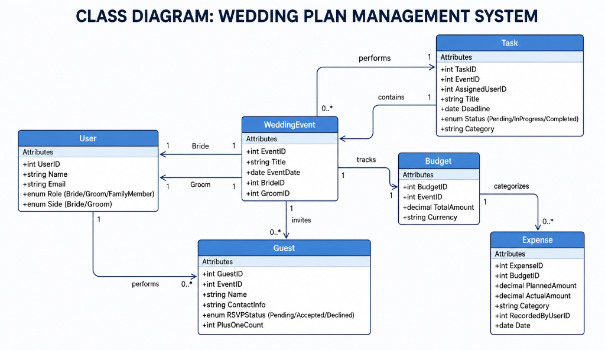

# WedPlan — Wedding Planning Management System

AUCA Web Technology Course Project built with **Java 8**, **JSF 2.3**, **CDI (Weld)**, **Hibernate ORM 5.6**, and **PostgreSQL**.

---

## Class Diagram



---

## Technology Stack
- **Java Compiler**: JDK 1.8 (Java 8)
- **Framework**: JavaServer Faces (JSF 2.3 - GlassFish Mojarra)
- **CDI**: Weld Servlet Shaded (3.1.9.Final)
- **ORM**: Hibernate ORM (5.6.15.Final)
- **Database**: PostgreSQL (Driver 42.7.4)
- **Packaging**: Maven Web Application (`war`)

---

## Domain Entities & Relationship
- **`User`**: `id` (PK), `name`, `email`, `role` (`BRIDE`, `GROOM`, `FAMILY_MEMBER`), `side` (`BRIDE`, `GROOM`).
- **`Task`**: `id` (PK), `eventId`, `title`, `deadline`, `status` (`PENDING`, `IN_PROGRESS`, `COMPLETED`), `category`, `assignedUser` (`@ManyToOne` -> `User` FK).

---

## Requirements Coverage

### 1. Three Types of Validation
- **Type 1 (Bean Validation / JSR-380)**: `@NotBlank`, `@Email`, `@Size`, `@NotNull`, `@FutureOrPresent` in `User.java` and `Task.java`.
- **Type 2 (Standard JSF Tags)**: `<f:validateLength>` and `<f:validateRegex>` in `userForm.xhtml`.
- **Type 3 (Custom JSF Validator)**: `@FacesValidator("taskDeadlineValidator")` in `TaskDeadlineValidator.java` referenced via `<f:validator>` in `taskForm.xhtml`.

### 2. Three Types of CSS Styling
- **Type 1 (External CSS)**: `resources/css/style.css` linked via `<h:outputStylesheet>`.
- **Type 2 (Internal CSS)**: `<style>` block inside `<h:head>` in `taskList.xhtml`.
- **Type 3 (Inline CSS)**: `style="..."` attributes on elements in `taskForm.xhtml`.

---

## How to Build & Run
```bash
# Compile and build WAR package targeting Java 8
mvn clean package
```
Deploy `target/WedPlan.war` to Apache Tomcat, WildFly, or GlassFish/Payara server.
Ensure PostgreSQL is running locally on port `5432` with database `wedding_plan_db`.
